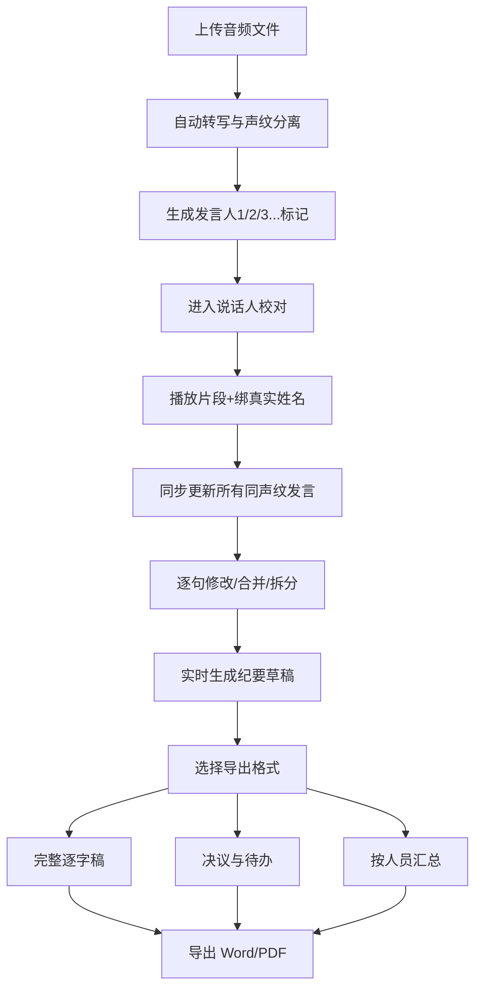

## 1. 产品概述

会议纪要工作台是一款面向企业行政秘书和总经理助理的专业 Web 应用，专注于多人例会录音的智能转写与声纹分离处理。通过自动化语音识别与说话人分离技术，大幅提升会议纪要整理效率，让秘书从繁重的听录工作中解放出来。

- **核心价值**：将数小时的会议录音整理时间压缩至分钟级，提升行政工作效率 80% 以上
- **目标用户**：企业行政秘书、总经理助理、会议组织者、项目经理
- **适用场景**：周例会、经营分析会、项目复盘会、部门讨论会等多人会议

## 2. 核心功能

### 2.1 用户角色

| 角色 | 登录方式 | 核心权限 |
|------|----------|----------|
| 行政秘书/总助 | 账号登录 | 上传音频、管理说话人档案、校对转写内容、导出会议纪要 |
| 普通参会人 | 链接查看 | 仅查看分享的会议纪要，无编辑权限 |

### 2.2 功能模块

1. **上传转写页**：音频上传、转写进度、声纹分离预览、说话人自动标记
2. **说话人校对页**：逐句编辑、片段合并/拆分、声纹绑名、实时纪要生成
3. **纪要导出页**：多格式导出预览、导出配置、历史记录

### 2.3 页面详情

| 页面名称 | 模块名称 | 功能描述 |
|----------|----------|----------|
| 上传转写页 | 上传区域 | 拖拽上传音频文件，支持 MP3/WAV/M4A 格式，显示文件信息 |
| 上传转写页 | 转写进度 | 实时显示转写进度条、已用时间、预计剩余时间 |
| 上传转写页 | 声纹预览 | 波形图展示、说话人分段彩色标记、发言人1/发言人2 自动标注 |
| 上传转写页 | 快捷操作 | 重新转写、取消转写、进入校对按钮 |
| 说话人校对页 | 时间轴面板 | 左侧时间轴列表，按说话人分色显示每段发言 |
| 说话人校对页 | 播放控制 | 播放/暂停、进度条、倍速调节、快进快退 |
| 说话人校对页 | 编辑工具 | 逐句修改文本、合并片段、拆分片段、删除片段 |
| 说话人校对页 | 说话人管理 | 绑定真实姓名、部门、角色，声纹库同步，批量重命名 |
| 说话人校对页 | 纪要预览 | 右侧实时生成按议题归纳的纪要草稿，可编辑调整 |
| 纪要导出页 | 格式选择 | 完整逐字稿、只看决议与待办、按人员汇总发言三种格式 |
| 纪要导出页 | 导出配置 | 文件格式（Word/PDF）、是否包含时间戳、是否匿名化处理 |
| 纪要导出页 | 预览区域 | 导出内容实时预览，支持分页查看 |
| 纪要导出页 | 历史记录 | 最近导出的会议记录列表，可重新下载 |

## 3. 核心流程

### 3.1 主要用户流程

用户上传会议音频文件后，系统自动进行语音转写和声纹分离，将不同说话人的发言按时间轴切分并自动标记为发言人1、发言人2等。秘书在校对页面可以播放任意片段，将声纹与真实姓名、部门、角色绑定，后续同一人的发言会自动同步改名。校对过程中可逐句修改文本、合并误切的片段、拆分串话的片段。右侧面板实时生成按议题归纳的纪要草稿。最后在导出页面选择所需格式，一键导出会议纪要。

### 3.2 声纹识别流程

## 4. 用户界面设计

### 4.1 设计风格

- **主色调**：深海蓝 `#1e3a5f` 作为主色，体现专业、稳重的企业级产品气质
- **辅助色**：珊瑚橙 `#ff6b6b` 用于强调操作和重要提示
- **功能色**：
  - 发言人1：天蓝色 `#4ecdc4`
  - 发言人2：暖黄色 `#ffd93d`
  - 发言人3：薄荷绿 `#6bcb77`
  - 发言人4：薰衣草紫 `#b19cd9`
- **中性色**：纯白背景、浅灰分隔、深灰正文，确保长时间使用不疲劳
- **按钮风格**：圆角 8px，微悬浮阴影效果，点击有轻微下沉反馈
- **字体**：标题使用 "Noto Sans SC" 黑体，正文使用系统无衬线字体，保证中文可读性
- **布局风格**：左右分栏布局，左侧工具/内容区，右侧预览/详情区，卡片式模块
- **图标风格**：线性简约图标，统一 2px 描边，与整体专业风格一致

### 4.2 页面设计概览

| 页面名称 | 模块名称 | UI 元素 |
|----------|----------|---------|
| 上传转写页 | 上传区 | 大尺寸虚线边框上传框、上传图标、支持格式提示、拖拽动效 |
| 上传转写页 | 进度区 | 渐变色进度条、百分比数字、状态文字动画 |
| 上传转写页 | 预览区 | 波形图可视化、彩色说话人分段标记、时间轴刻度 |
| 说话人校对页 | 时间轴 | 左侧列表，每条目含头像色块、说话人姓名、时间戳、文本预览 |
| 说话人校对页 | 播放栏 | 底部固定播放器，波形进度条，播放控制按钮组 |
| 说话人校对页 | 编辑区 | 选中文本高亮显示，编辑工具栏悬浮 |
| 说话人校对页 | 说话人面板 | 头像+姓名+部门+角色卡片，颜色标签可自定义 |
| 说话人校对页 | 纪要面板 | 右侧可折叠面板，议题树状结构，要点列表 |
| 纪要导出页 | 格式卡 | 三个大卡片横向排列，选中态有边框高亮和勾选标记 |
| 纪要导出页 | 配置区 | 开关组件、下拉选择、输入框，分组排列 |
| 纪要导出页 | 预览区 | 模拟纸张效果，带阴影和页边距，可滚动预览 |

### 4.3 响应式设计

- 采用桌面端优先设计，针对 1440px 及以上宽度优化
- 平板端（1024px）：左右分栏改为上下分栏，纪要预览移至下方
- 移动端仅支持查看纪要，不支持上传和校对操作
- 所有交互元素确保最小 44px 触控尺寸

### 4.4 交互动效

- 页面切换：淡入淡出 + 轻微位移动画，时长 300ms
- 说话人绑名：颜色渐变过渡，同名片段高亮闪烁提示
- 合并/拆分操作：片段高度平滑过渡，配合弹性缓动
- 实时纪要：新内容生成时有打字机效果逐字显示
- 悬停反馈：卡片悬浮上移 2px + 阴影加深
- 加载状态：骨架屏占位，内容渐入替换
