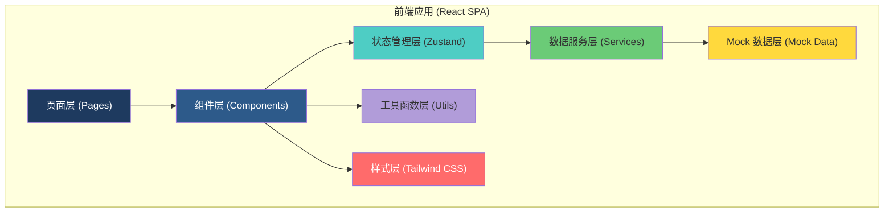
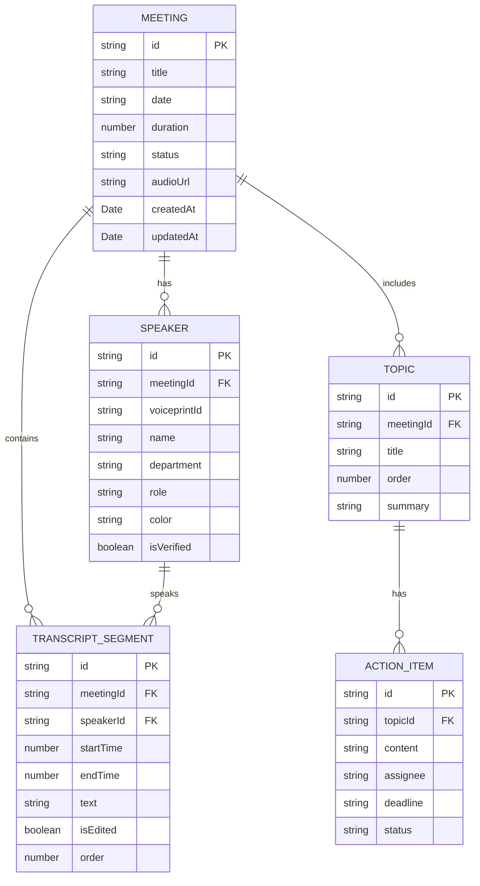

## 1. 架构设计

本项目为纯前端单页应用，使用 Mock 数据模拟后端转写与声纹分离服务。整体采用分层架构，确保模块职责清晰、易于维护和扩展。



## 2. 技术选型

| 类别 | 技术 | 版本 | 说明 |
|------|------|------|------|
| 构建工具 | Vite | 5.x | 极速开发体验，原生 ESM 支持 |
| 前端框架 | React | 18.x | 函数式组件 + Hooks |
| 开发语言 | TypeScript | 5.x | 类型安全，提升代码质量 |
| 样式方案 | Tailwind CSS | 3.x | 原子化 CSS，快速开发 |
| 状态管理 | Zustand | 4.x | 轻量级状态管理，简单易用 |
| 路由方案 | React Router | 6.x | 声明式路由，支持嵌套路由 |
| 图标库 | Lucide React | 最新 | 线性简约图标，符合设计风格 |
| 音频可视化 | wavesurfer.js | 7.x | 波形图渲染，支持多色区域标记 |
| 文件导出 | file-saver | 最新 | 客户端文件下载 |
| 富文本 | contentEditable | 原生 | 逐句文本编辑 |

## 3. 路由定义

| 路由路径 | 页面名称 | 说明 |
|----------|----------|------|
| `/` | 首页/工作台 | 显示最近会议列表和快捷入口 |
| `/upload` | 上传转写页 | 音频上传与转写进度展示 |
| `/proofread/:meetingId` | 说话人校对页 | 转写内容校对与说话人管理 |
| `/export/:meetingId` | 纪要导出页 | 多格式导出配置与预览 |

## 4. 数据模型

### 4.1 数据模型定义



### 4.2 Mock 数据说明

- 使用 Mock 数据模拟真实的会议转写结果
- 提供 2-3 个完整的会议示例数据，包含 4-6 位说话人
- 说话人默认标记为"发言人1"、"发言人2"等，颜色各异
- 包含模拟的转写文本，覆盖常见会议场景
- 预设部分议题和待办事项，用于演示实时纪要生成

## 5. 项目目录结构

```
src/
├── assets/              # 静态资源
│   ├── icons/           # 自定义图标
│   └── audio/           # 示例音频
├── components/          # 通用组件
│   ├── layout/          # 布局组件
│   │   ├── Header.tsx
│   │   ├── Sidebar.tsx
│   │   └── PageContainer.tsx
│   ├── ui/              # 基础 UI 组件
│   │   ├── Button.tsx
│   │   ├── Card.tsx
│   │   ├── Modal.tsx
│   │   ├── Switch.tsx
│   │   └── ProgressBar.tsx
│   └── meeting/         # 会议相关组件
│       ├── WaveformPlayer.tsx
│       ├── SpeakerCard.tsx
│       ├── TranscriptItem.tsx
│       └── TopicList.tsx
├── pages/               # 页面组件
│   ├── Dashboard.tsx
│   ├── UploadPage.tsx
│   ├── ProofreadPage.tsx
│   └── ExportPage.tsx
├── store/               # 状态管理
│   ├── useMeetingStore.ts
│   └── useSpeakerStore.ts
├── services/            # 数据服务
│   ├── meetingService.ts
│   └── exportService.ts
├── mock/                # Mock 数据
│   ├── meetings.ts
│   ├── speakers.ts
│   └── transcripts.ts
├── types/               # TypeScript 类型定义
│   └── index.ts
├── utils/               # 工具函数
│   ├── time.ts
│   ├── format.ts
│   └── audio.ts
├── App.tsx
├── main.tsx
└── index.css
```

## 6. 核心功能实现方案

### 6.1 音频上传与转写

- 使用 HTML5 File API 处理文件上传
- 模拟转写进度，分段更新进度条
- 上传完成后自动跳转或提示进入校对

### 6.2 波形可视化

- 使用 wavesurfer.js 渲染音频波形
- 通过 Regions 插件标记不同说话人片段
- 支持点击波形跳转到对应时间点播放

### 6.3 说话人绑名

- 点击说话人标签弹出编辑面板
- 修改后通过声纹 ID 批量更新所有同名片段
- 提供颜色选择器自定义说话人标识色

### 6.4 片段编辑

- 合并：选中多个相邻片段，点击合并按钮
- 拆分：在文本光标位置拆分片段为两段
- 删除：标记为删除，支持撤销操作

### 6.5 实时纪要生成

- 监听转写内容变化
- 基于关键词和规则自动识别议题
- 提取决议和待办事项，实时更新右侧面板

### 6.6 多格式导出

- 完整逐字稿：按时间顺序排列所有发言
- 决议与待办：只提取结论、决议和待办事项
- 按人员汇总：按说话人分组展示发言内容
- 支持导出为 .txt 和 .html 格式（模拟 Word/PDF）
